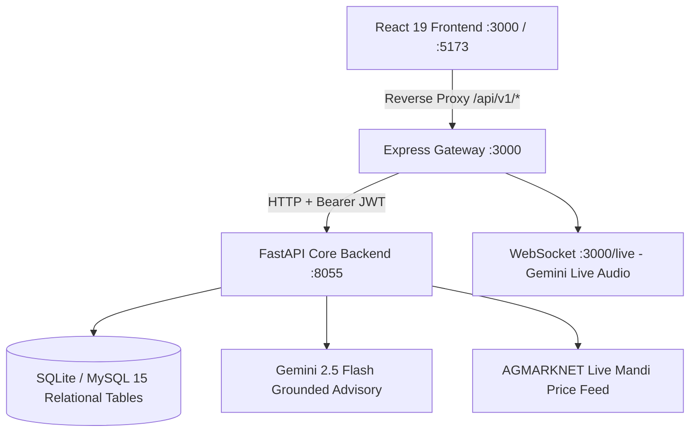

# GRAM-DISHA (Project ERGON) — Evaluator & Demo Guide
**Smart India Hackathon 2026**  
**Category:** Rural Economic Development, MSME Enablement & Truth-First Financial Structuring  
**Team:** ERGON  

---

## 1. System Architecture Overview

GRAM-DISHA is an AI-copiloted enterprise structuring operating system built specifically for rural and semi-urban Indian micro-entrepreneurs. It replaces generative hallucination with deterministic, mathematical, and rule-bound banking evaluations.



### Core Technologies
- **Frontend:** React 19, TypeScript, Tailwind CSS v4, Motion (Framer Motion), Lucide React.
- **Gateway:** Express.js 4 with transparent HTTP proxy, rate limiting, and Whisper speech integration.
- **Backend:** FastAPI, Python 3.10+, SQLAlchemy, Pydantic v2 (Dual Camel/Snake Model).
- **Engines:** Deterministic RBI Amortization Engine, 8-Factor HBFS Feasibility Engine, Rule-Based Scheme Matcher (7 Schemes).
- **AI Advisory:** Google Gemini 2.5 Flash grounded with active enterprise financials, APMC mandi rates, and official MSME/KVIC regulations.
- **Persistence:** SQLite (`backend/gram_disha.db`) with production MySQL/PostgreSQL support.

---

## 2. Quick Launch Instructions

### Option A: One-Click Launch (Windows)
Double-click:
```cmd
start_all.bat
```

### Option B: One-Click Launch (Linux / macOS)
```bash
chmod +x start_all.sh
./start_all.sh
```

### Option C: Manual Launch
1. **Start FastAPI Backend (Terminal 1):**
   ```bash
   cd backend
   python seed_data.py
   python -m uvicorn app.main:app --port 8055 --host 127.0.0.1
   ```
2. **Start Express / Frontend Gateway (Terminal 2):**
   ```bash
   npm run dev
   ```

### Access URLs
- **Web Application:** `http://localhost:3000`
- **Interactive API Swagger Docs:** `http://127.0.0.1:8055/docs`
- **Backend Health Check:** `http://127.0.0.1:8055/health`

---

## 3. Seeded Accounts for Evaluation

| Role | Email | Password | Pre-loaded Context |
| :--- | :--- | :--- | :--- |
| **Beneficiary (Citizen)** | `ramesh.patil@gramdisha.in` | `Demo@123` | *Patil Organic Pulse Mill* (Yavatmal, MH), ₹8.5L project cost, 35% PMEGP subsidy match, active inventory. |
| **Administrator (DIC Officer)** | `admin@gramdisha.gov.in` | `Admin@123` | District Task Force Committee screening view, master dataset sync, and system monitoring. |

*Alternatively, click **"Instant Demo Login"** on the landing page for immediate 1-click evaluation access.*

---

## 4. Evaluator Live Demonstration Script

Follow these 12 steps to test every capability of the platform:

### Step 1: Landing Page & Authentication
- Navigate to `http://localhost:3000`.
- Notice the rural-first design language, language selector (English, Hindi, Marathi), and core value pillars.
- Click **"Instant Demo Login"** (or use `ramesh.patil@gramdisha.in` / `Demo@123`).
- **Result:** Authenticated with signed FastAPI JWT access token; redirects to Dashboard.

### Step 2: Dashboard Overview
- View the active enterprise card: **Patil Organic Pulse Mill** (Agro-Processing, Yavatmal, Rural).
- Notice dynamic KPI cards: HBFS score (73.9%), Project Outlay (₹8.50L), Top Subsidy (35% PMEGP), and Pusad APMC ODOP status.
- Observe real operational counters: Registered stock items, low-stock alerts, and logged revenue.

### Step 3: Financial Engineering & Amortization
- Click **"Finance"** on the sidebar.
- Adjust capital breakdown sliders:
  - Machinery Cost: `₹4,80,000`
  - Shed & Civil Works: `₹1,80,000`
  - Initial Raw Material: `₹1,40,000`
  - Total Outlay: `₹8,50,000`
- **Result:** Amortization engine computes authoritative numbers directly from `POST /api/v1/finance/calculate`:
  - **Monthly EMI:** `₹11,403` (5 years @ 9.5% p.a.)
  - **DSCR:** `1.52x` (safely exceeding RBI 1.35x bank underwriting threshold)
  - **Break-Even Volume:** `632 kg/month`

### Step 4: 8-Factor HBFS Feasibility Assessment
- Click **"Feasibility"** on the sidebar.
- Click **"Run Feasibility Assessment"** to trigger `POST /api/v1/feasibility/assess`.
- **Result:** Evaluates \( \text{HBFS} = 0.25 D + 0.15 A + 0.10 I + 0.10 S + 0.10 Sc - 0.05 C - 0.15 Cap - 0.20 U \).
  - Score: **73.9%** (`HIGH_FEASIBILITY`, Grade A).
  - Produces structured 4-quadrant SWOT matrix and lead bank appraisal viability summary.

### Step 5: Government Scheme Matcher
- Click **"Government Schemes"** on the sidebar.
- The system evaluates user profile against 7 official central and state schemes:
  - **PMEGP:** Matched at 35% capital subsidy (₹2,97,500 assistance).
  - **PMFME:** Matched for ODOP pulse milling grant.
  - **Mudra Tarun / Kishore:** Pre-screened for working capital credit.
- Review the official KVIC / MoMSME policy references and required document checklists.

### Step 6: Scheme Application Dossier
- Click **"Apply for PMEGP"** on the matched scheme card.
- System submits application dossier to `POST /api/v1/applications`.
- **Result:** Application created with tracking ID `PMEGP-MH-YAV-2026` under stage `District Task Force Committee Verification`.

### Step 7: Bankable DPR Generation
- Click **"Bankable DPR"** or **"Documents"** on the sidebar.
- Click **"Generate Official Bank DPR"** to trigger `POST /api/v1/documents/dpr/generate`.
- **Result:** Generates complete SIDBI-format 5-year projections (Year 1 to 5 capacity utilization 60%–90%, EBITDA, depreciation, net profit, cash accrual, debt service) and statutory compliance checklist.
- Click **"Download Official Bank Dossier"** for PDF export.

### Step 8: Disha Grounded AI Co-Pilot
- Click the floating **DISHA AI** button (bottom right) or open the Disha advisory panel.
- Type the query:
  > *"What is my DSCR and how does the bank evaluate it?"*
- **Result:** Grounded reply generated by Gemini 2.5 Flash with business context injection:
  - References enterprise's exact **1.52x DSCR**.
  - Cites **RBI MSME Master Circular** prudential underwriting norms.
  - Suggests next operational steps without numerical hallucination.

### Step 9: Micro-ERP Inventory & Sales
- Click **"Inventory & Operations"** on the sidebar.
- View current stock registers (Raw Chana: 25.0 Quintals, Processed Dal: 80 Bags).
- Click **"+ Record Sale"**:
  - Product: `Organic Dal 1kg`
  - Units Sold: `10`
  - Rate: `₹95/kg`
  - Total: `₹950`
- Click **"Confirm Transaction"** to call `POST /api/v1/inventory/sales`.
- **Result:** Stock decreases by 10 units; revenue updates immediately across operations view and dashboard.

### Step 10: APMC Mandi Market Intelligence
- Click **"Market Insights"** on the sidebar.
- Select district **"Yavatmal"** and commodity **"Bengal Gram (Chana)"**.
- **Result:** Real AGMARKNET price bulletin loaded:
  - Modal Price: **₹6,180 / Quintal**
  - Daily Arrivals: **48.5 Tonnes**
  - Provenance: Directorate of Marketing & Inspection (DMI), MoA&FW with SHA-256 verification hash.

### Step 11: Action Plan & Milestones
- Click **"Action Plan"** on the sidebar.
- View 5 sequential launch milestones.
- Click the checkmark on **"Udyam MSME Registration"** to call `PATCH /api/v1/action-plan/milestones/1/toggle`.
- **Result:** Milestone toggles to `COMPLETED`; overall implementation progress percentage increases.

### Step 12: Citizen Support & Helpdesk
- Click **"Support & Grievances"** on the sidebar.
- View verified escalation helplines (MSME Champions: `1800-572-8888`, KVIC Helpdesk: `1800-3000-0034`).
- Submit a test inquiry: *"Please confirm DIC Task Force screening date."*
- **Result:** Ticket lodged in `support_tickets` table with reference code `GRV-2026-SCHEME-XXXX`.

---

## 5. Automated Verification & Testing

To independently verify all backend unit tests and live end-to-end integration:

```bash
# Run End-to-End Live Integration Verification (12 Checks)
cd backend
python test_integration_live.py

# Run Complete Backend Pytest Suite (71 Tests)
python -m pytest tests/ -v
```

### Expected Output
```
Testing End-to-End Integration...
  [OK] Health Check Passed
  [OK] Auth Login & JWT Generation Passed
  [OK] Auth Google OAuth Passed
  [OK] Finance Calculation Passed
  [OK] Feasibility /assess Route Alias Passed
  [OK] Applications GET Route Alias Passed
  [OK] Applications POST Route Alias Passed
  [OK] Applications PUT Route Alias Passed
  [OK] Documents /dpr/generate Route Alias Passed
  [OK] Inventory Sales Record (rate_per_unit alias) Passed
  [OK] Support Ticket Creation Passed
  [OK] Disha Grounded AI Chat Passed

ALL 12 INTEGRATION TESTS SUCCESSFULLY PASSED!
```
```
70 passed, 1 skipped, 64 warnings in 9.61s
```
